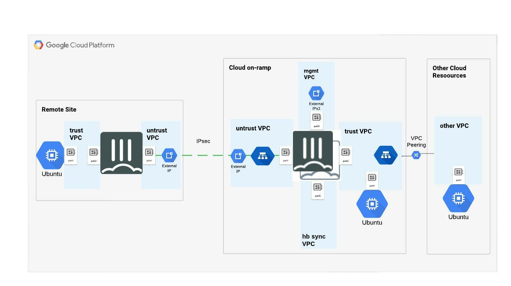
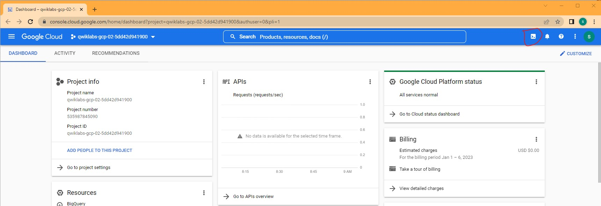
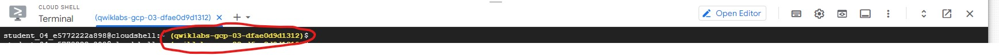
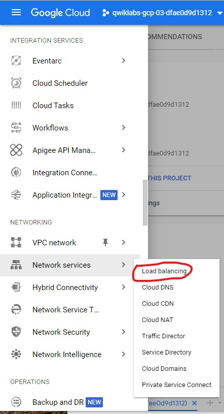
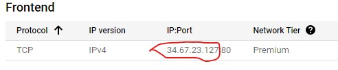
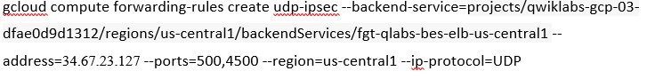
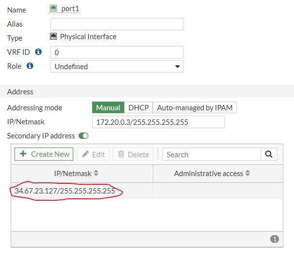
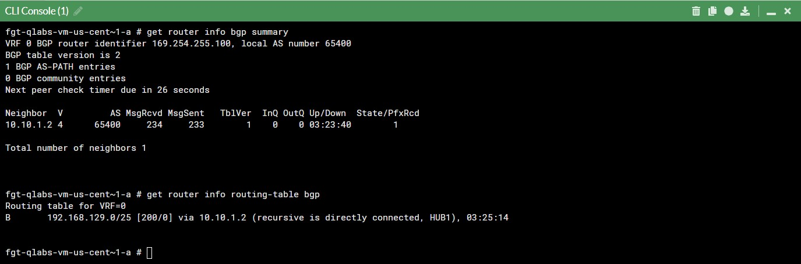
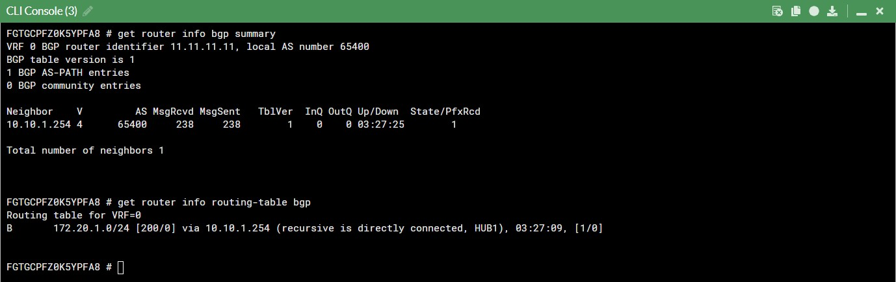

# Create Network Overlay and Configure SD-WAN Components

In previous labs, we built a Cloud on-ramp using two FortiGates deployed as a High Availability pair sandwiched between two Load Balancers.  We also built a remote site using a single FortiGate and Ubuntu server.  The next step is to securely connect the remote location with the cloud on-ramp.  In the following excercises, we will configure the IPsec overlay.  BGP will be used to share routes between locations.  Once the overlay is in place, we will configure SD-WAN to monitor SLA

* Network Diagram

    

***

## Chapter 1 - Build Network Overlay

***[Deployment exercise - estimated duration 45min]***

<details>

<summary>In this chapter, we will create the dialup IPsec VPN hub on the on-ramp FortiGate and configure the remote site to connect to it.   </summary>

### Task 1 - Add Forwarding Rule to the Load Balancer

#### Tidbit - There is no way to add forwarding rules to the Load Balancer using the GUI Console.  For this step, we will need to open a cloud shell and use the Google SDK.  As you will see in the following steps, we need to create forwarding rules to allow the load balancer to forward UDP ports 500 and 4500 to the FortiGate

* We will be using the below Google sdk command to create the forwarding rule.  Copy and paste the below command into your favorite text editor.  The next few steps will help us get the require environment variables (project-id, lb-ip)

```sh
gcloud compute forwarding-rules create udp-ipsec --backend-service=projects/<project-id>/regions/us-central1/backendServices/fgt-qlabs-bes-elb-us-central1 --address=<lb-ip> --ports=500,4500 --region=us-central1 --ip-protocol=UDP
```

* From the GCP console dashboard, select click on the cursor **>_** at the top of the screen.  This will open a **CLOUD SHELL Terminal** at the bottom of the screen.

    

* Get the project-id by copying it from the cloud shell prompt.  We do not need the open and close parentheses.

    

* Get the lb-ip.  Under hamburger menu  select MORE PRODUCTS > Network services > **Load balancing**.  In the center of the screen, Click on LOAD BALANCERS > **fgt-qlabs-bes-elb-us-central1**.

    

* In the center of the screen, under **Frontend** copy the IP address

    

* Once you have the project-id and lb-ip, update the sdk command from earlier and input it into the cloud shell.  Below is an example of what that command should look like.

    

* You should now see the new rule under **Frontend**

### Task 2 - Configure IPsec VPN Hub on cloud on-ramp FortiGate

#### Tidbit - The GCP Load Balancer does not perform Destination NAT on inbound traffic to the FortiGate, meaning that the Destination IP address in the UDP port 500 IPsec packets are set to the Load Balancer's external IP address.  We will need to add this IP as secondary to the "WAN" interface (port1) on FortiGate

* Log into the active FortiGate of the cloud on-ramp HA pair.  On the left pane, select **Network** > **Inerfaces**.  Click on port1 and select **Edit**  Under Address, toggle the **Secondary IP address** button and input the lb-ip from earlier.

    

* Open a CLI console in the active FortiGate by clicking on the cursor **>_** icon or using SSH to the public management IP.  Copy the below configurations into your favorite text editor and "set local-gw" to the lb-ip. Once completed, copy and paste thes configurations into the cli console.

```sh
config vpn ipsec phase1-interface
    edit HUB1
        set type dynamic
        set interface port1
        set ike-version 2
        set local-gw <lb-ip>
        set peertype any
        set net-device disable
        set mode-cfg enable
        set proposal aes256-sha256
        set add-route disable
        set dpd on-idle
        set ipv4-start-ip 10.10.1.2
        set ipv4-end-ip 10.10.1.25
        set ipv4-netmask 255.255.255.0
        set psksecret Fortinet1!
        set dpd-retryinterval 60
    next
end


config vpn ipsec phase2-interface
    edit HUB1
        set phase1name HUB1
        set proposal aes256-sha256
    next
end
config system interface
   edit HUB1
        set vdom root
        set ip 10.10.1.254 255.255.255.255
        set allowaccess ping
        set type tunnel
        set remote-ip 10.10.1.1 255.255.255.0
        set snmp-index 18
        set interface port1
    next
end

config firewall policy
    edit 0
        set name ipsec-in
        set srcintf HUB1
        set dstintf port2
        set action accept
        set srcaddr all
        set dstaddr all
        set schedule always
        set service ALL
        set nat enable
    next
end

```

#### Tidbit - Notice that we are using mode config here.  This will result in IP addresses being dynamically assigned to the IPsec interface on the remote sites.  Make a mental note of the "ip4v-start-ip" and "ipv4-stop-ip".  This range will be used later to configure BGP

### Task 3 - Configure IPsec VPN on remote site

* Open a CLI console in the FortiGate by clicking on the cursor **>_** icon or using SSH to the public management IP.  Copy the below configurations into your favorite text editor and "set remote-gw" to the lb-ip. Once completed, copy and paste thes configurations into the cli console.

```sh
config vpn ipsec phase1-interface
    edit HUB1
        set interface port1
        set ike-version 2
        set peertype any
        set net-device disable
        set mode-cfg enable
        set proposal aes256-sha256
        set add-route disable
        set dpd on-idle
        set remote-gw <lb-ip>
        set psksecret Fortinet1!
    next
end


config vpn ipsec phase2-interface
    edit HUB1
        set phase1name HUB1
        set proposal aes256-sha256
        set auto-negotiate enable

    next
end

config firewall policy
    edit 0
        set name ipsec-out
        set srcintf port2
        set dstintf HUB1
        set action accept
        set srcaddr all
        set dstaddr all
        set schedule always
        set service ALL
        set nat disable
    next
    edit 0
        set name ipsec-in
        set srcintf HUB1
        set dstintf port2
        set action accept
        set srcaddr all
        set dstaddr all
        set schedule always
        set service ALL
        set nat enable
    next
end
```

* Run the below commands to ensure that the tunnels are up and functioning proplerly.

```sh
get vpn ipsec tunnel summary
diagnose vpn ike gateway list name HUB1
```

#### Useful Link - https://community.fortinet.com/t5/FortiGate/Troubleshooting-Tip-IPsec-VPNs-tunnels/ta-p/195955

### Task 4 - Configure BGP on cloud on-ramp FortiGate

* Copy the below BGP configurations and paste them into the active FortiGate's CLI console.

```sh
config router bgp
    set as 65400
    set ibgp-multipath enable
    set additional-path enable 
    set additional-path-select 4
    config neighbor-group
        edit HUB1
            set remote-as 65400
            set additional-path both
            set adv-additional-path 4
            set route-reflector-client enable
        next
    end
    config neighbor-range
        edit 1
            set prefix 10.10.1.0 255.255.255.0
            set max-neighbor-num 20
            set neighbor-group HUB1
        next
end

    config network
        edit 1
            set prefix 172.20.1.0 255.255.255.0
        next
    end
end
```

#### Tidbit - note the prefix setting under "config neighbor-range".  The dynamic IP addresses assigned to the remote site IPsec VPN interfaces fall within that range, meaning that this router will accept any bgp peer request from those remote sites.

### Task 4 - Configure BGP on remote FortiGate

* Copy the below BGP configurations and paste them into the FortiGate's CLI console.

```sh
config router bgp
    set as 65400
    set ibgp-multipath enable
    set additional-path enable
    set additional-path-select 4
    config neighbor
        edit 10.10.1.254
            set remote-as 65400
            set additional-path receive
        next
    end
    config network
        edit 1
            set prefix 192.168.129.0 255.255.255.128
        next
    end
end

```

* Ensure that BGP peers are established and that routes are being shared on both the hub and remote site.

```sh
get router info bgp summary
get router info routing-table bgp
```

* Below are the expected outputs

    

        

* Ensure continuity from Hub by pinging the remote site Ubuntu server.

```sh
execute ping 192.168.129.3
```

* Ensure continuity from remote site by pinging the Hub Ubuntu server.

```sh
execute ping 172.20.1.5
```

***

</details>

## Chapter 2 - Configure SD-WAN

***[Make it work - estimated duration 15min]***

<details>

<summary>Now that we have configured the overlay, we will add the "WAN" interface (port1) and the IPsec HUB1 interface to SD-WAN.  We will then create SLA monitoring in the remote site.</summary>

### Task 1 - TBA

* This will get filled out later

* **Congratulations!** You have completed the GCP-Basic portion of this training.

***
  </details>

***

<!-- ## Quiz


### Question 1

* A VM Instance in GCP can have multiple interfaces in the same VPC Network.  (True or False)

<details> 

<summary>Answer</summary>

* **False** - VMs can only have a single interface per VPC Network.

</details>

## Question 2

* By default, External IP Addresses associated with vNICs in GCP are preserved across reboot (True or False)

<details> 

<summary>Answer</summary>

* **False** - By default.  Ephemeral External IP Addresses are assigned to vNICs in GCP.

</details> -->
